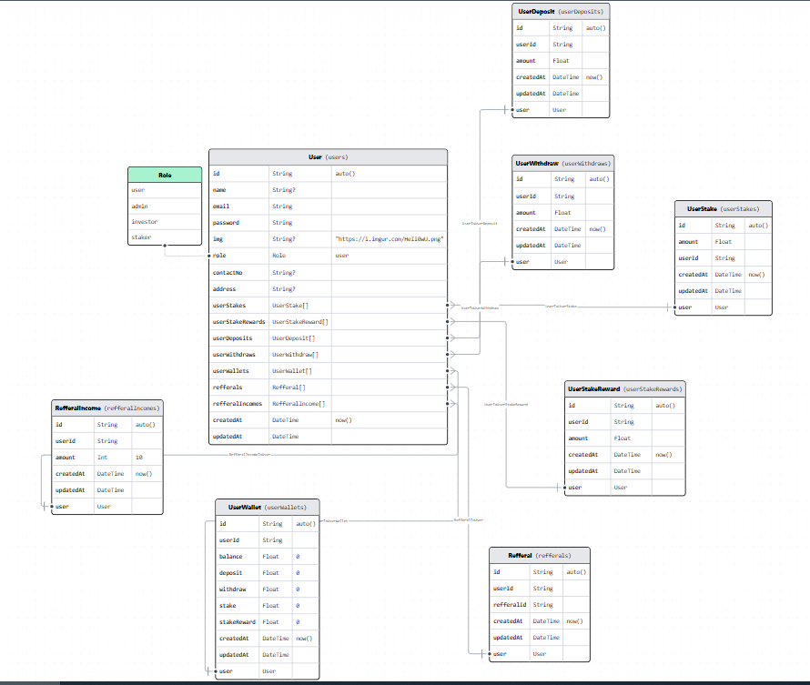

# This project is for a Online Trading App Backend.

## Description

This is a backend for a Online Trading App where user can invest their money for trading purpose. It is built with implementing CRUD operations, used `$transaction` for logical groups of processing data in *Mongodb* that needs to encapsulate several operations, pagination and filtering using *Prisma*, *MongoDB*, *Typescript* and *Express*.

## Features

- [x] Implemented CRUD operations
- [x] Implemented Authentication and Authorization
- [x] Implemented Pagination and Filtering
- [x] Implemented `$transaction` for logical groups of processing data in *Mongodb* that needs to encapsulate several operations.
- [x] Implemented `Zod` for validation
- [x] Implemented `JWT` for authentication
- [x] Implemented `Bcrypt` for hashing password
- [x] Implemented `Prisma` for ORM
- [x] Implemented `Typescript` for type checking

## Technologies Used

- [x] Express.js
- [x] Typescript
- [x] Prisma
- [x] MongoDB
- [x] Zod
- [x] JWT
- [x] Bcrypt

## Entity Relationship Diagram

<p>

</p>

## Project Setup:

```
npm init -y
npm install prisma typescript ts-node @types/node --save-dev
npx tsc --init
<!-- npx prisma  -->
npx prisma init
```

### Prisma Client

```
 npm i @prisma/client
 npx prisma studio
```

### Generate Prisma Client

```
    npx prisma generate
```

### This is a link to the backend API hosted on vercel [Live Site](https://investor-trading.vercel.app/)

## API Endpoints

### User

- [x] Create User `POST /api/v1/auth/register`
- [x] Login User `POST /api/v1/auth/login`

### Referrals

- [x] Create Referral `POST /api/v1/referrals/createReferral`

###### Do not forget to feedback or starred if you like it.